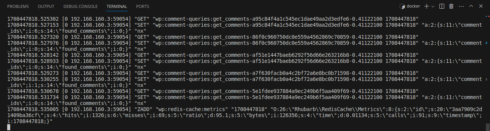

<h1 align=center>
	<b>Bonus</b>
</h1>

<p align=center>
	The bonus part of the Inception project is a step further into Docker's complexities and a few other services that might be useful to you in the near future (or not, who knows). Just as I've done in the Mandatory part, I will try to keep it as simple as possible, but I will also try to give you a better understanding of the tools and services we are going to use.
</p>

---
<h2 align=center> Index </h2>
<h3 align="center"><b>
	<a href="#Redis">Redis Cache</a>
	<span> • </span>
	<a href="#FTP">FTP Server</a>
	<span> • </span>
	<a href="#Static">Static Website</a>
	<span> • </span>
	<a href="#Adminer">Adminer</a>
	<span> • </span>
	<a href="#Optional">Optional</a>
</b></h3>

---

<h2 id="Redis">
Redis Cache
</h2>


But after all, what is Redis? To put it in simple terms, Redis is used as a database, cache, and message broker. Its main purpose is to store data in memory, which makes it a lot faster than traditional databases. It is also a key-value store, which means that it stores data in a dictionary-like structure, where each key is associated with a value. This makes it a great tool for caching, as it can store data in memory and retrieve it quickly.

In this part of the project, we will build a whole container for Redis, and we will also use it to cache the requests made to the API. This will make our application a lot faster, as it will not need to make requests to the database every time a user makes a request to the API.

The standard port for Redis is 6379, and we will use it in our application. We will need to update our docker-compose file appropriately, and we will also need to update our application to use Redis as a cache.

### 1. Install Redis

To start, let's prepare our new container for Redis. We need to install `redis-server`in our container, and we also need to expose the port 6379. We will also need to set the `command` for the container, so it starts the Redis server when the container is started. 

We can also configure the `redis.conf` file to set up a few details about the Redis server. Here's a list of the most important configurations you might want to change:

- `port`: The port the Redis server will listen to. The default is 6379.
- `bind`: The IP address the Redis server will listen to. The default is 127.0.0.1, which means it will only listen to requests from the local machine.

In the end, we will only alter the configuration file in order to comment on the `bind` line. In doing so, we will allow redis service to listen to requests from any host (since Wordpress and Redis are in different containers).

```bash
# bind 127.0.0.1
```

After making sure your Redis server is properly configured, you will also need to set up your Wordpress application to use Redis as a cache. You will need to install the `redis` PHP extension. This can only be done in your Wordpress container. 

Once inside the Wordpress container, edit the `wp-config.php` file once again to enable the Redis cache. You will need to add the following lines to the file:

```php
define( 'WP_REDIS_PORT', '6379' );
define( 'WP_REDIS_HOST', 'redis' );
define( 'WP_CACHE', 'true' );
```

### 2. Install Redis via wp-cli

In order to make sure everything is working properly, you can use wp-cli to install the Redis plugin. You can do this by running the following command:

```bash
wp config set WP_REDIS_HOST redis
wp config set WP_REDIS_PORT 6379
wp config set WP_CACHE true
```

Then, you can use wp-cli to download the Redis plugin:

```bash
wp plugin install redis-cache --activate
wp redis enable
```

### 3. Make sure Redis is working

To make sure Redis is working properly, you can use the `redis-cli` to connect to the Redis server and check if it is working properly. You can also use the `MONITOR` command to check the server's status.


```bash
docker exec -it redis redis-cli

MONITOR -
```

Then, go to your wordpress website and edit or add anything: posts, comments, themes, etc. There will appear all sorts of logs in your terminal. 



If your screen looks anything like mine, that means that Redis is not only installed and running, but also capturing all the requests made to the database. This means that your application is now using Redis as a cache, and it is a lot faster than it was before.

If you want to check redis info or keys, use the following commands:

```bash
docker exec -it redis redis-cli

INFO
KEYS *
```

### 4. Redis Dockerfile

```Dockerfile
FROM        debian:bullseye

# Update and upgrade system & install Redis
RUN         apt -y update && apt -y upgrade
RUN         apt -y install redis-server redis-tools

# Expose port
EXPOSE      6379

# Create PID directory for Redis
RUN         mkdir -p /run/redis
RUN         chmod 755 /run/redis

# Configure Redis
RUN         cp /etc/redis/redis.conf /etc/redis/redis.conf.bak
RUN         sed -i 's/bind 127.0.0.1/#bind 127.0.0.1/' /etc/redis/redis.conf

# Run Redis
ENTRYPOINT  [ "redis-server", "--protected-mode", "no" ]
```

---
<h2 id="FTP">
FTP Server
</h2>


An FTP server is a software that allows you to transfer files from one computer to another over the internet. It is a very useful tool for web developers, as it allows them to upload files to a server without having to use the command line. It is also a great tool for sharing files with other people, as it allows you to create accounts for other people to access your server.

In this part of the project, we will build a whole container for an FTP server. We will use `vsftpd` as our FTP server, and it will point to the wordpress directory. This means that you will be able to upload files to your wordpress server using an FTP client.

### 1. Install vsftpd

To start, let's prepare the new container for `vsftpd`. You will need to install `vsftpd` in your container, and you will also need to expose the port 21. You will also need to set the `command` for the container, so it starts the `vsftpd` server when the container is started.

To first start the configuration of the `vsftpd` server, you will need to create a new user. This is necessary because the FTP server will need to have a user to authenticate the connections. You can do this by running the following command:

```bash
adduser ftpuser --disabled-password
```

Then, you will need to set the password for the user. You can do this by running the following command:

```bash
echo "ftpuser:password" | chpasswd
```

After creating the user, you will need to configure the `vsftpd` server. The FTP user you just created will need to be on the server user list.

```bash
echo "ftpuser" | tee -a /etc/vsftpd/vsftpd.userlist
```
Then, create the folder where the FTP server will point to. This is the folder where you will be able to upload files to your server. Per the project's requirements, we will point the FTP server to the wordpress directory in your docker-compose file.

```bash
mkdir -p /home/ftpuser/data/wordpress
chown ftpuser:ftpuser /home/ftpuser/data/wordpress
chmod 755 /home/ftpuser/data/wordpress
```

And at last, you will need to edit the `vsftpd.conf` file to set up a few details about the `vsftpd` server. Here's a list of the most important configurations you might want to change:

- `write_enable`: This option allows the FTP user to upload files to the server. The default is commented, and you will need to uncomment it.
- `chroot_local_user`: This option will jail the FTP user to its home directory. The default is commented, and you will need to uncomment it.
- `local_enable`: This option allows the FTP user to log in to the server. You will need to add this line to the file.
- `allow_writeable_chroot`: This option will allow the FTP user to upload files to the server. You will need to add this line to the file.
- `local_root`: This option will set the root directory for the FTP server. You will need to add this line to the file.
- `pasv_enable`: This option will enable passive mode for the FTP server. You will need to add this line to the file.
- `pasv_min_port`: This option will set the minimum port for passive mode. You will need to add this line to the file.
- `pasv_max_port`: This option will set the maximum port for passive mode. You will need to add this line to the file.
- `userlist_file`: This option will set the file with the list of users that can log in to the server. You will need to add this line to the file.

After all that, restart your `vsftpd` service.

### 2. Make sure FTP is working
To make sure the FTP server is working properly, you can upload a file to the server through an FTP client. To do it, you will need to download an FTP client and connect to your server. You can use the following commands:

```bash
docker exec -it ftp bash
apt -y install ftp
ftp localhost
```

Then, you will need to log in to the server using the FTP user you just created. You can use the following commands:

```bash
ftp> open localhost
ftp> Name (localhost:root): ftpuser
ftp> Password: password
```

After logging in, you will need to upload a file to the server. It could be any file of your choice (create one with vim, if you will). You can use the following commands:

```bash
ftp> put file.txt
```

Then, you can check if the file was uploaded to the server by running the following command in you local machine:

```bash
ls /home/$USER/data/wordpress
```

If the file is there, that means that the FTP server is working properly, and you can now upload files to your server using an FTP client.

### 3. FTP Dockerfile

```Dockerfile
FROM        debian:bullseye

# Define build arguments passed from docker-compose.yml
ARG         FTP_USER
ARG         FTP_PASSWORD

# Set environment variables
ENV         FTP_USER=${FTP_USER}
ENV         FTP_PASSWORD=${FTP_PASSWORD}

# Update and upgrade system & install FTP
RUN         apt -y update && apt -y upgrade
RUN         apt -y install vsftpd ftp

# Set up FTP
COPY        ./conf/vsftpd.conf /usr/local/bin/
COPY        ./tools/init.sh /usr/local/bin/
RUN         chmod 755 /usr/local/bin/init.sh

# Expose port
EXPOSE      20 21 21100-21110

# Run FTP
ENTRYPOINT  [ "bash", "/usr/local/bin/init.sh" ]
```

---
<h2 id="Static">
Static Website
</h2>

---
<h2 id="Adminer">
Adminer
</h2>

---
<h2 id="Optional">
Optional
</h2>
