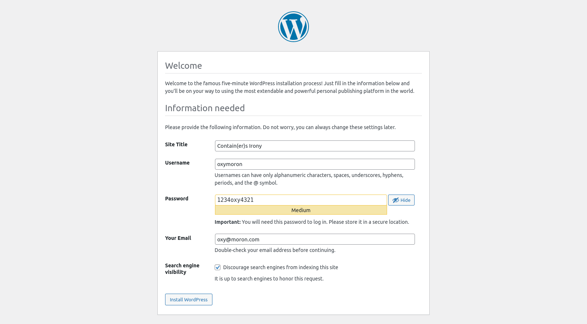

<h1 align=center>
	<b>Mandatory</b>
</h1>

<p align=center>
	<b>Inception</b> is a project that aims for us to broaden our knowledge on system administration. We need to virtualize several Docker images, creating them in a personal virtual machine. Each service should run in a different container, but all of them should be called from a docker-compose.yml file and be connected to a single docker-network.
</p>
<p align=center>
	In order to start this task we must choose between 2 available images: <b>Alpine Linux</b> or <b>Debian</b>. I consider Debian to be the obvious choise, for reasons that will be explained later on. But first, let's contextualize. 
</p>


---
<h2 align=center> Index </h2>
<h3 align="center"><b>
	<a href="#Docker">What is Docker?</a>
	<span> • </span>
	<a href="#Virtual">Virtual Machines and Containers</a>
	<span> • </span>
	<a href="#Images">Choosing our image: Alpine Linux or Debian?</a>
	<span> • </span>
	<a href="#PreReq">Pre-Requisites</a>
	<span> • </span>
	<a href="#DockerCompose">Docker Compose</a>
	<span> • </span>
	<a href="#MariaDB">MariaDB</a>
	<span> • </span>
	<a href="#Wordpress">Wordpress</a>
	<span> • </span>
	<a href="#NGINX">NGINX</a>
	<span> • </span>
	<a href="#COMPOSE">Docker Compose File</a>
	<span> • </span>
	<a href="#Site">Contain(er)s Irony</a>

</b></h3>

---

<h2 id="Docker">
What is Docker?
</h2>


Docker is a type virtualization application that gives you the ability to run thousands of so-called **containers** in a single machine. 

To better understand what a container is, think about it as a **lightweight virtual machine**. It is a self-contained package of software that includes everything needed to run it: code, runtime, system tools, system libraries, and settings. Containers isolate software from its surroundings, for example, differences between development and staging environments and help reduce conflicts between teams running different software on the same infrastructure.

Docker containers are based on **images**. An image is a read-only template with instructions for creating a Docker container. Often, an image is based on another image, with some additional customization. For example, you may build an image which is based on the **ubuntu** image, but installs the Apache web server and your application, as well as the configuration details needed to make your application run.

Containers are sandboxed from one another and from the host machine. Docker provides tools for container creation, image handling, and management, as well as a way to keep everything together using **docker-compose**.

The idea is that you can package your application with everything it needs to run, and ship it as a single package. This ensures that your application will always run the same, regardless of the environment it is running in. 

Docker gives you and your peers the stability necessary to run the exact same code on laptops, data center VMs, and production cloud instances, guaranteeing fast and reliable deployments, testing, and continuous integration across multiple platforms.

---

<h2 id="Virtual">
Virtual Machines and Containers
</h2>

As you may have realized, Docker and Virtual Machines are pretty similar in their purpose, but they are not the same thing. To make things easier, let's discuss their main differences and purposes, as well as each of their pros and cons.

**Virtual machines (VMs)** and **Containers** both allow you to run applications in isolated environments, as well as depend on vitualization technology and secondary images. However, the way they interact with the host OS and the resources they use are different.

**VMs** run on a physical machine using a hypervisor, which is a piece of software that emulates the underlying hardware. The hypervisor allocates resources to each VM, including memory, CPU, storage, and networking. Each VM has its own OS, and the hypervisor manages interactions between the VMs and the host OS.

**Containers**, on the other hand, run on a single OS kernel. They share the host OS kernel and resources with other containers, making them lightweight and fast to start. This is important: Containers do **not** have their own OS. What they have is a set of binaries and libraries that run in isolation, on top of the host OS. They are isolated at the **process** level, and each container has its own file system. This makes them more portable and efficient than VMs.


Does that mean my Docker image must be of the same OS as my host OS? Not necessarily. Docker images can be of any OS, but they will always run on top of the host OS kernel, so they will need to be compatible with it. For example, you can run a Debian image on top of an Ubuntu host OS, but you cannot run a Windows image on top of a Linux host OS. Linux and Windows use different kernels, so they are not compatible. However, you can run - albeit with some limitations - a CentOS image on top of an Ubuntu host OS, because they both use the Linux kernel.

So this is the first distinction we need to make: **Docker Images** and **VM images** are **not** the same thing. Docker images are not full-fledged OS images, they are just a set of binaries and libraries that run on top of the host OS kernel. VM images, on the other hand, are full-fledged OS images, with their own kernel and resources.

With everything that has been said, it looks like Containers are much more suitable for most use-case scenarios, but that is not always the case.

VMs are more suitable for running applications that require all of the host OS resources and functionality, such as Windows applications. They are also more suitable for running applications that require a full OS, such as Windows Server or Linux Server. VMs are also more suitable for running applications that require a **high level of security** and **isolation** from other applications, such as banking applications.

Containers, on the other hand, are more suitable for running applications that require less resources and functionality from the host OS, such as web applications. They are also more suitable for running applications that require a high level of **portability** and **scalability**, such as microservices. Containers are also more suitable for running applications that require a high level of performance, such as high-traffic web applications.

They choice between VMs and Containers depends on your specific requirements and preferences. This project, for example, is a perfect use-case scenario for Docker, as we will be running several applications that require less resources and functionality from the host OS, such as web applications, and that require a high level of portability and scalability, such as microservices.

---

<h2 id="Images">
Choosing our image: Alpine Linux or Debian?
</h2>

For this project, we will need to choose two images: one for our Virtual Machine (that will be our Docker host OS) and one for our Docker containers. The host OS image will be used to run our Virtual Machine, and the Docker image will be used to run our containers.

As it was detailed before, Docker images not necessarily need to be of the same OS as the host OS. However, they will always run on top of the host OS kernel, so they will need to be compatible with it.

Even though we can, in theory, choose different Linux OS for each, for better compatibility we will opt for the same distribution for both. For this project, we have two options: **Alpine Linux** or **Debian**.

Both Alpine Linux and Debian are popular choices for building Docker containers, and each has its own set of advantages and disadvantages. The choice between them depends on your specific requirements and preferences.

### Alpine Linux:


| Pros | Cons |
| :---: | :---: |
| **Size**: Alpine Linux is known for its small image size. It's extremely lightweight, with minimal packages installed by default. This makes Alpine a popular choice for containers when minimizing image size is crucial. | **Compatibility**: Some software that expects a full glibc environment might not work properly on Alpine without adjustments. |
| **Security**: Due to its minimalistic nature, Alpine tends to have a smaller attack surface, which can enhance security. It uses the musl libc instead of glibc, which can have some security benefits. | **Limited package availability**: The Alpine package repositories may not have as extensive a selection as Debian. |
| **Package Manager**: Alpine uses the **apk** package manager, which is simple and effective for managing packages within containers. |  |

### Debian:


| Pros | Cons |
| :---: | :---: |
| **Stability**: Debian is known for its stability and wide package availability. It has a long history of being a reliable choice for various server applications. | **Larger image size**: Debian images are typically larger than Alpine images, which can lead to longer image pull times and increased storage requirements. |
| **Compatibility**: Because Debian uses the glibc standard C library, it's more compatible with software that expects a traditional Linux environment. | **Slightly higher resource usage**: Due to the larger image size, Debian images may use slightly more resources than Alpine images. |
| **Package Manager**: Debian uses **apt** as its package manager, which is highly versatile and widely used. |  |

### General Purposes and Use Cases:

- **Alpine**: Alpine is an excellent choice when you need minimalism, especially for microservices or single-purpose containers. It's ideal for situations where image size and security are paramount, such as in edge computing or container orchestration platforms like Kubernetes.

- **Debian**: Debian is a versatile choice for a wide range of use cases. It's suitable for applications that require compatibility with a variety of software, and its extensive package repository makes it a solid choice for general-purpose containers, especially in traditional server environments.

Ultimately, the choice between Alpine and Debian comes down to your specific requirements, including image size, compatibility, and the software you need to run in your containers.

Considering all of this, I chose to use **Debian** for my project, for two main reasons:

- **Versatility**: From the get go, I had every intention on doing all Bonus parts. Debian provides more compatibility between different and broader features.
- **Documentation**: Say what you want, but Debian has been, overtime, more used elsewhere and, therefore, more documentated. You can find just about anything for Debian troubleshooting, which makes this whole ordeal much easier.

<h2 id="PreReq">
Pre-Requisites
</h2>

Now, let's prepare to the fun part. Before we can start working on the project, though, we need to set up our environment, and that said environment consists of a Virtual Machine and Docker installed on it.

For this, the initial setup consists of only two downloadables:

- [VirtualBox](https://www.virtualbox.org/wiki/Downloads): VirtualBox is a general-purpose full virtualizer, aimed at enabling users to run multiple operating systems in virtual machines. For this project, we will be using VirtualBox to run a Debian system on top of our own OS.
- [Debian](https://www.debian.org/distrib/netinst): Debian is an open-source operating system that runs from the desktop, to the cloud, to all your internet connected things. We will be using Debian inside our VirtualBox to run the project.

I will not be covering the installation of these two, as they are pretty straightforward. If you have any issues, you can find plenty of tutorials online.

If you're from 42 São Paulo (as I am), you may be more inclined to use the official 42user VM, available at the [Guia de Sobrevivência](https://42sp.notion.site/Guia-de-Sobreviv-ncia-Cadetes-eac127ab72c84acea6f229ca813adfc1) webpage. Either way, make sure to have a full functioning Linux Machine at the end of this step. 

Once you have your Virtual Machine up and running with an OS of your choice, you will need to install Docker. To do so, you can follow the steps below:

1. Update and upgrade your system:

```bash
sudo apt update && sudo apt upgrade
```

2. Install Docker:

```bash
sudo apt install docker.io
```

3. Check if Docker is running:

```bash
sudo systemctl status docker
```

4. If it is not running, start it:

```bash
sudo systemctl start docker
```

System should be up and running.

---

<h2 id="DockerCompose">
Docker Compose
</h2>


Let's imagine the following scenario: you need to deploy an application. This application is composed of several services, such as a web server, a database, a cache, and so on (Hipotetically, of course, not at all like your project should be).

To set up this application, you need to install and configure each service individually, making sure that each one is properly configured and that they are all connected to each other. This can be a very time-consuming and error-prone process, especially if you need to deploy the application multiple times, for example, in different environments.

This is where **Docker Compose** comes in. Docker Compose is a tool for defining and running multi-container Docker applications. With Compose, you use a simple file to describe how your application should be built and run, and then you can run a single command to create and start all the services from your configuration. Amazing right?

Remember that: Docker Compose is your friend.

In order to be able to use docker compose, you need to make sure it's also installed in your system. To do so, you can follow the steps below:

1. Install Docker Compose:

```bash
sudo apt install docker-compose
```

Docker compose has 2 versions available: V1 and V2. As of May 10, 2021, V1 has not received any more updates, and therefore is considered deprecated. For this project, we will be using V2 as default. 

Compose V2 is called through command line without the hyphen, like this:

```bash
docker compose version
```

If the code below does not work, you will need to manually install V2 on your VM. To do so, you can follow the steps below:

1. Download the latest version of Docker Compose:

```bash
#Installing Docker Compose V2
DOCKER_CONFIG=${DOCKER_CONFIG:-$HOME/.docker}
mkdir -p $DOCKER_CONFIG/cli-plugins
curl -SL https://github.com/docker/compose/releases/download/v2.2.3/docker-compose-linux-x86_64 -o $DOCKER_CONFIG/cli-plugins/docker-compose

#Make it executable
chmod +x $DOCKER_CONFIG/cli-plugins/docker-compose

#Check if it works!
docker compose version
```

To understand the differences between V1 and V2, you can check the [official documentation](https://docs.docker.com/compose/migrate/).

And to properly understand what System Administration is, you also need to be able understand the importance of **automating** everything. This is called **Infrastructure as Code**. You need to be able to write a script that will do everything for you, so that you can just run it and have everything set up and running. Docker Compose is a tool that will help you do just that.

So now, let's understand how Docker Compose works.

### YAML

Docker Compose uses a YAML file. But what is YAML?

**YAML** is a human-readable data serialization language. In summary, it is a way to represent data structures in a way that is easy to read and write for humans. It is commonly used for configuration files, but could be used in many applications where data is being stored or transmitted.

YAML is a superset of JSON, which means that any valid JSON file is also a valid YAML file. However, YAML uses indentation instead of brackets to define data structures, which makes it simpler and easier to read.

Example of YAML syntax:

```yaml
# This is a comment

key: value # This is a key-value pair

list: # This is a list
  - item1
  - item2
  - item3

dictionary: # This is a dictionary
  key1: value1
  key2: value2
  key3: value3

list_of_dicts: # This is a list of dictionaries
  - key1: value1
	key2: value2
	key3: value3
  - key1: value1
	key2: value2
	key3: value3
  - key1: value1
	key2: value2
	key3: value3
```

YAML is a very simple and easy to learn language. You can find more information about YAML [here](https://yaml.org/).

### Docker Compose File

Docker Compose uses a YAML file called **docker-compose.yml** to define the services that make up your application. You can then use the **docker-compose** command to create and start all the services from your configuration.

The docker-compose.yml file is divided into **services**. Each service is a container that will run a specific application. For example, you can have a service that runs a web server, another service that runs a database, and so on.

Each service has a set of properties that define how it should be built and run. These properties include the name of the image to use, the ports to expose, the volumes to mount, etc.

Docker Compose file example:

```yaml
version: "3.9" # Version of the docker-compose file

services: # List of services
  service1: # Service 1
	image: image1 # Image to use
	ports: # Ports to expose
	  - "80:80"
	  - "443:443"
	volumes: # Volumes to mount
	  - volume1
	  - volume2
	networks: # Networks to connect to
	  - network1
	  - network2
  service2: # Service 2
	image: image2 # Image to use
	ports: # Ports to expose
	  - "80:80"
	  - "443:443"
	volumes: # Volumes to mount
	  - volume1
	  - volume2
	networks: # Networks to connect to
	  - network1
	  - network2
  service3: # Service 3
	image: image3 # Image to use
	ports: # Ports to expose
	  - "80:80"
	  - "443:443"
	volumes: # Volumes to mount
	  - volume1
	  - volume2
	networks: # Networks to connect to
	  - network1
	  - network2
  service4: # Service 4
	image: image4 # Image to use
	ports: # Ports to expose
	  - "80:80"
	  - "443:443"
	volumes: # Volumes to mount
	  - volume1
	  - volume2
	networks: # Networks to connect to
	  - network1
	  - network2
```

To get a full list of all the properties that can be used in a docker-compose.yml file, you can check the [official documentation](https://docs.docker.com/compose/compose-file/).

### Repository Structure

Your `docker-compose.yml` file should be in the srcs/ folder, located in the root of your repository. Each service should be in its own sub-folder, and each sub-folder should have its own `Dockerfile` (To be explained below).

To run your docker-compose.yml file, you can use the following command:

```bash
docker-compose up
```
However, we will be using a Makefile to run our docker-compose.yml file, as it will make our lives much easier. More on that later on.

The tree structure of your application configuration will look something like this:

```bash
.
├── Makefile
└── srcs/
	├── .env
    ├── docker-compose.yml
    └── requirements/
        ├── service1/
        │   └── Dockerfile
        ├── service2/
        │   └── Dockerfile
        └── service3/
            └── Dockerfile
```

### Dockerfile

A **Dockerfile** is a text document that contains all the commands a user could call on the command line to assemble an image. Using `docker build` users can create an automated build that executes several command-line instructions in succession.

Dockerfiles adhere to a specific format and use a specific set of instructions. You can find more information about Dockerfiles [here](https://docs.docker.com/engine/reference/builder/).

Dockerfiles are used to build Docker images. Each service in your docker-compose.yml file will use a Dockerfile to build its image.

Dockerfile example:

```dockerfile
FROM debian:bullseye # Base image

RUN apt-get update && apt-get install -y package1 package2 package3 # Install packages

COPY srcs/ / # Copy files from host to container

RUN chmod 777 / # Change permissions

CMD ["executable", "param1", "param2"] # Run command
```

To each service in this project, we will be using a Dockerfile to build its image.

> As per the project's requirements, we need to use the penultimate stable version of Debian, which is called **Bullseye**. To check all the Debian releases, you can check [here](https://wiki.debian.org/DebianReleases). For reference on how to use Debian in Docker, you can check [here](https://hub.docker.com/_/debian).

---

<h2 id="MariaDB">
MariaDB
</h2>


**MariaDB** is a community-developed, commercially supported fork of the MySQL relational database management system (RDBMS), intended to remain free and open-source software under the GNU General Public License. Development is led by some of the original developers of MySQL, who forked it due to concerns over its acquisition by Oracle Corporation in 2009.

MariaDB intends to maintain high compatibility with MySQL, ensuring a "drop-in" replacement capability with library binary equivalency and exact matching with MySQL APIs and commands. It includes the XtraDB storage engine for replacing InnoDB, as well as a new storage engine, Aria, that intends to be both a transactional and non-transactional engine perhaps even included in future versions of MySQL.

MariaDB offers more storage engines than MySQL, including Cassandra (NoSQL), XtraDB (drop-in replacement for InnoDB), and OQGRAPH (used for shortest path analysis). It is also more open and community-driven, with the main development being done by the company MariaDB Corporation, but also with the help of the community. MariaDB is also more secure, with more security features than MySQL, such as encryption, authentication, and auditing.

### 1. Install MariaDB:

```bash
sudo apt-get -y install mariadb-server
```

### 2. Configure MariaDB:

Now, there are a few ways to do this. If you're installing and configuring MariaDB manually via command line, you can use the following command:

```bash
sudo mysql_secure_installation
```

However, we're not manually inputing any command into the terminal here. Since our goal is to **automate** the process of setting up your infrastructure, you will need to find ways to use the configuration files found in your system in your favor. 

One way to do this is through the `/etc/mysql/my.cnf` file. This is the main configuration file for MariaDB, and it contains all the settings that control the behavior of the MariaDB server. ALso, it imports any file inside the directories `conf.d` and `mariadb.conf.d`, so you can easily organize your configurations, based on services, as well as you please.

Now, to properly configure MariaDB, you will need to make sure that your configuration file has, at least, the following settings:

```bash
[mysqld]
# Allow connections from any IP address
bind-address = 0.0.0.0

# Enable TCP/IP networking
skip-networking = 0

# Port for TCP/IP connections
port = 3306
```
Socket communication will also need to be disabled, in case it isn't already.

Now, let's go for the creating of the Wordpress Database itself. This is the database that will be responsible for keep all your wordpress website information, as well as users info, themes, layout, posts, comments, etc. It needs to exist in your mariadb container and be ready to receive all the data that wordpress you generate.

First, you need to get into your mariadb service as root user. 

```bash
mariadb -u root -p
```

Then, you need to pass the following SQL commands, in order to create the database, the MySQL user, their password and allow them to connect to your DB through the network. 

```sql
CREATE DATABASE IF NOT EXISTS '<Wordpress Database>';
CREATE USER IF NOT EXISTS '<MySQL user>'@'%' IDENTIFIED BY '<MySQL Password>';
GRANT ALL PRIVILEGES ON $MYSQL_DATABASE.* TO '<MySQL user>'@'%';
FLUSH PRIVILEGES;
```

Replace `Wordpress Database`, `MySQL user`, and `MySQL Password` with the name of your database, the username you want to create, and the password you want to use, respectively.

### 3. MariaDB dump.sql

When you finally get your Wordpress website all set up, you will be able to import all of your site's settings and data into your MariaDB database. This is done by importing a `.sql` file into your database (it will be explained in the Wordpress section). 

It's important to notice you will only be able to generate the dump once you've finished setting up your Wordpress container. So if you haven't yet, come back here when you do. 

During the MariaDB installation, most often then not there is another service installed with it: `mysqldump`. This is the service you will use to generate the dump file. 

After the containers are up and running, and your wordpress have been successfully configured, you can use the following command to access your mariadb container:

```bash
docker exec -it mariadb /bin/bash
```

It will open a direct connection to your mariadb container's shell environment, and then you can use your `mysqldump` service to generate the file you need:

```bash
mysqldump -u $USERNAME -p $DATABASE > dump.sql
```

You will be prompted to type in your mariadb server user (it can also be root).

The `dump.sql` file will need to be copied back to your computer and inception folder. To do that, you can use the external volume in which you have access: `/var/lib/mysql`.


### 4. MariaDB Dockerfile

```dockerfile
# Base image
FROM        debian:bullseye

# Define build arguments passed from docker-compose.yml
ARG         MYSQL_DATABASE
ARG         MYSQL_USER
ARG         MYSQL_PASSWORD
ARG         MYSQL_ROOT_PASSWORD

# Update and upgrade system & install MariaDB
RUN         apt -y update && apt -y upgrade
RUN         apt -y install mariadb-server mariadb-client

#allow mysqld daemon to run, purge and recreate /var/lib/mysql with appropriate ownership
RUN			mkdir -p /var/lib/mysql /var/run/mysqld
RUN			chown -R mysql:mysql /var/lib/mysql /var/run/mysqld
RUN			chmod 777 /var/run/mysqld

# Copy the MariaDB configuration file and dump.sql file
COPY        ./conf/mariadb.cnf /etc/mysql/mariadb.conf.d/
RUN         chmod 644 /etc/mysql/mariadb.conf.d/mariadb.cnf
COPY        ./conf/dump.sql /usr/local/bin/

# Execute MariaDB Initialization script
COPY        ./tools/init.sh /usr/local/bin/
RUN         bash /usr/local/bin/init.sh

# Expose port to the host
EXPOSE      3306

# Run MariaDB
ENTRYPOINT  [ "mysqld_safe" ]
```

---
<h2 id="Wordpress">
Wordpress
</h2>


**Wordpress** is a free and open-source content management system written in PHP and paired with a MySQL or MariaDB database. Features include a plugin architecture and a template system, referred to within WordPress as Themes. 

WordPress was originally created as a blog-publishing system but has evolved to support other types of web content including more traditional mailing lists and forums, media galleries, membership sites, learning management systems (LMS) and online stores. 

WordPress is used by more than 60 million websites, including 39% of the top 10 million websites as of 2021, WordPress is one of the most popular content management system solutions in use.

### 1. Configure Wordpress

Setting up a Wordpress website is a very simple process. You can do it manually, by downloading the Wordpress files from the official website and setting up a LAMP stack, or you can use a tool like Docker to automate the process.

First, you need to download (via curl or wget) the latest version of Wordpress. You can do so by using the following command:

```bash
curl -O https://wordpress.org/latest.tar.gz
```

Then, you need to extract the files from the tarball:

```bash
tar -xvf latest.tar.gz
```

After that, you need to move the files (or the whole foldere) to the root of your web server. You can do so by using the following command:

```bash
mv wordpress /var/www/html/
```

And then, you will need to configure your `wp-config.php` file. This file is located in the root of your Wordpress installation, and it contains all the settings that control the behavior of your Wordpress website. You can do so by using the following command:

```bash
mv /var/www/html/wordpress/wp-config-sample.php /var/www/html/wordpress/wp-config.php
```

You will need to edit the `wp-config.php` file to include the settings for your database. However you do it, it's ultimately up to you. All you need to know is to replace the following lines with the settings for your database:

```php
define('DB_NAME', 'database_name_here');
define('DB_USER', 'username_here');
define('DB_PASSWORD', 'password_here');
define('DB_HOST', 'database hostname here');
```

It's important to notice that, since we will be using different containers for our database and our wordpress, you will need to replace the `DB_HOST` line with the hostname of your database container. This is the name of the service in your `docker-compose.yml` file. In our case, it will be `mariadb`.

Another way to properly configure your Wordpress website is through the wp-cli. This is a command line tool that allows you to manage your Wordpress website from the command line. You can use it to install Wordpress, configure your website, and manage your content. If you're up for the bonus part, it will be a great tool to use.

### 2. Configure Wordpress via wp-cli

First, you will need to install the wp-cli. You can do so by using the following command:

```bash
wget https://raw.githubusercontent.com/wp-cli/builds/gh-pages/phar/wp-cli.phar
```

Make sure your wp-cli.phar file is executable:

```bash
chmod +x wp-cli.phar
```

Then, you can move the wp-cli.phar file to your `/usr/local/bin` directory, so that you can use it as a command line tool:

```bash
mv wp-cli.phar /usr/local/bin/wp
```

Then, you can use wp-cli to set up your Wordpress website. You can do so by using the following command:

```bash
wp config set DB_NAME database_name_here
wp config set DB_USER username_here
wp config set DB_PASSWORD password_here
wp config set DB_HOST mariadb
```

You can check your wp-config.php file to make sure that the settings were properly configured. 

### 3. Configure php-fpm

After making sure that the wp-config.php file is properly configured, you will also need to edit the `www.conf` file in your php-fpm service, to make sure that it can communicate with your Nginx server via port 9000. This is done by using the `listen` directive in the `www.conf` file locate in` /etc/php/<php-version>/fpm/pool.d/`.

```conf
[www]

user = www-data
group = www-data

listen = 0.0.0.0:9000

listen.owner = www-data
listen.group = www-data

pm = dynamic

pm.max_children = 25

pm.start_servers = 5

pm.min_spare_servers = 1

pm.max_spare_servers = 10
```

After setting up the Wordpress container, you will startyour Nginx server. This will be explained in the NGINX section.

### 4. Setting up Wordpress for the first time

Only after all your containers are up and running, you can access your website by going to the server name or IP address in your web browser. If that's not your case, come back to this section after finishing the NGINX section.

In my case, `cado-car.42.fr` is the server name I will need to use, according to the project's requirements. Also, it will not accessible via port 80. 


After choosing the language, you will be prompted to enter the information for your website, such as the site title, the username and password for the admin user, and the admin email address. You will also be prompted to choose whether or not to allow search engines to index your site. 



After entering the information, you can click on the "Install WordPress" button. Confirm that the data you entered is correct, and then click on the "LogIn" button.


You will be prompted to log in to your website using the username and password you entered earlier. 


After logging in, you will be able to access the admin dashboard, where you can manage your website, create new posts and pages, and install new themes and plugins.


This is all for a first time Wordpress installation. However, we will be using a Dockerfile to automate the process of setting up your Wordpress website. 

To make sure that it's your website that is going to be deployed, you will need to create a dump of your database, and then import it into your MariaDB container. This is done by using the `mysqldump` service, as it was explained in the MariaDB section.

Also, in case you have any custom themes or plugins, you will need to copy them to the `wp-content` folder in your Wordpress installation. This is the folder where all the themes and plugins for your website are stored. 

In my case, I used the default theme, but imported a few customized images. Therefore, I only needed to copy my `wp-content/uploads` folder into my wordpress container.

### 5. Wordpress Dockerfile

```dockerfile
# Base image
FROM        debian:bullseye

# Define build arguments passed from docker-compose.yml
ARG         MYSQL_DATABASE
ARG         MYSQL_USER
ARG         MYSQL_PASSWORD
ARG         MYSQL_HOSTNAME

# Update and upgrade system & install MariaDB client, php-fpm and php-mysql and wget
RUN         apt -y update && apt -y upgrade
RUN         apt -y install wget php7.4-fpm php7.4-mysql mariadb-client

# Configure PHP so it can communicate with NGINX
RUN         mv /etc/php/7.4/fpm/pool.d/www.conf /etc/php/7.4/fpm/pool.d/www.conf.default
COPY        ./conf/www.conf /etc/php/7.4/fpm/pool.d/
RUN         ln -s $(find /usr/sbin -name 'php-fpm*') /usr/bin/php-fpm

# Expose port
EXPOSE      9000

# Create PID directory for PHP-FPM
RUN         mkdir -p /run/php
RUN         chmod 755 /run/php

# Execute Wordpress Initialization script
COPY        ./tools/init.sh /usr/local/bin/
RUN         bash /usr/local/bin/init.sh

# Copy Wordpress customized content
RUN         mkdir -p /var/www/html/wordpress/wp-content/uploads/2024/02/
COPY        ./conf/uploads/* /var/www/html/wordpress/wp-content/uploads/2024/02/
RUN         chmod -R 755 /var/www/html/wordpress/wp-content/uploads/
RUN         chmod 644 /var/www/html/wordpress/wp-content/uploads/2024/02/*
RUN         chown -R www-data:www-data /var/www/html/wordpress/wp-content/uploads/

# Run php-fpm
ENTRYPOINT  [ "php-fpm", "-F" ]
```

---

<h2 id="NGINX">
NGINX
</h2>


Inception demands us set up a NGINX server, using TLSv1.2 or TLSv1.3. 

**NGINX** is a web server that can also be used as a reverse proxy, load balancer, mail proxy and HTTP cache. It is free and open-source, and it is used by over 400 million websites. It is known for its high performance, stability, rich feature set, simple configuration, and low resource consumption.

**TLS**, on the other hand, is a cryptographic protocol designed to provide communications security over a computer network. TLS is the successor to the Secure Sockets Layer (SSL) protocol. TLS works by encrypting data between two communicating parties, such as a client and a server. This ensures that the data cannot be read or modified by anyone who is not authorized to access it. TLS also provides authentication, which means that the client can be sure that it is communicating with the correct server, and that the server can be sure that it is communicating with the correct client.


> #### What's the difference between a key and a certificate? 
> A **key** is a piece of information that controls the cryptographic operation. A **certificate** is a digitally signed statement that binds the value of a public key to the identity of the person, device, or service that holds the corresponding private key.
>
> #### What's the difference between TLS and SSL?
> TLS and SSL are cryptographic protocols that provide secure communications over a computer network. TLS is the successor to SSL, and it is more secure and more widely used than SSL. However, the term SSL is still commonly used to refer to TLS.

Now, let's learn how to set up NGINX and TLS. 

### 1. Install NGINX and OpenSSL:

```bash
sudo apt-get install nginx openssl -y
```

### 2. Generate a self-signed certificate:

```bash
sudo openssl req -x509 -sha256 -nodes -days 365 -newkey rsa:4096 -keyout /etc/ssl/private/nginx-selfsigned.key -out /etc/ssl/certs/nginx-selfsigned.crt -subj "/C=BR/ST=Sao Paulo/L=Sao Paulo/O=42SP/OU=Inception/CN=localhost"
```
> #### Understanding each one of the flags:
> - `**req**`: We are using the `req` command to generate a certificate request. This is the default subcommand when none is specified.
> - `**x509**`: This option outputs a self signed certificate instead of a certificate request. This is typically used to generate a test certificate or a self signed root CA.
> - `**sha256**`: This option is used to specify the message digest to sign the request with. It's basically a hash function useful for generating an unique identifier for a file, so that we can use it to verify that the certificate is valid. It's also called a **fingerprint**.
> - `**nodes**`: If this option is specified then if a private key is created it will not be encrypted. It's importamt to use it when we are generating a self-signed certificate as part of an automated process, as we will be doing.
> - `**days**`: When the -x509 option is being used this specifies the number of days to certify the certificate for. The default is 30 days, but we'll be using `365` as recommended.
> - `**newkey**`: This option creates a new certificate request and a new private key. The argument takes one of several forms. Here, we'll be using `rsa:nbits`, where nbits is, in our case, `4096` bits.
> - `**keyout**`: This gives the filename to write the newly created private key to. In our case, we'll be using `/etc/ssl/private/nginx-selfsigned.key`.
> - `**out**`: This specifies the output filename to write to or standard output by default. In our case, we'll be using `/etc/ssl/certs/nginx-selfsigned.crt`.
> - `**subj**`: This option sets the subject name to use. The arg must be formatted as /type0=value0/type1=value1/type2=..., characters may be escaped by \ (backslash), no spaces are skipped. The actual value supplied must be appropriate for the certificate being generated. In our case, we'll be using `/C=BR/ST=Sao Paulo/L=Sao Paulo/O=42SP/OU=Inception/CN=localhost`.

Take note on the name of both the key and the certificate, as we will be using them later on to configure our NGINX server.

- **key**: `/etc/ssl/private/nginx-selfsigned.key`
- **certificate**: `/etc/ssl/certs/nginx-selfsigned.crt`

### 3. Configure NGINX: 

This is the core step for this module. But first, we need to understand that NGINX is text-based configured. This means that all of its configuration is done via text files, located in specific directories avaliable after NGINX installation.

The main NGINX repository is located in `/etc/nginx/`. Inside this directory, we have several sub-directories, each one with a specific purpose. There's a default configuration file in `/etc/nginx/nginx.conf`, but it is not recommended for us to edit it directly. Instead, we will be creating our own configuration file in `/etc/nginx/conf.d/` directory. 

NGINX has many available features, like caching, load balancing, and so on. We must think of creating a single configuration file for each feature we want to use. The convention of naming these files is to use the `.conf` extension, so that NGINX can recognize them as configuration files. For example: 

- a configuration file for caching would be named `caching.conf`;
- a configuration file for load balancing would be named `load_balancing.conf`;
- a configuration file for a web server would be named `https.conf` - This is the one we will be using.

As per the specification, we will be configuring NGINX's web server to only listen to port `443`. We will also be configuring it to use TLSv1.2 or TLSv1.3, as required by the project.

To do so, create `https.conf` in your project repository, and set it up accordingly. To use variables, you can check the [official documentation](http://nginx.org/en/docs/varindex.html).

```conf
server {
	# Listen to ports 80 and 443
	listen 443 ssl;
	listen [::]:443 ssl;

	# Set server name
	server_name INSERT_DOMAIN_NAME_HERE;

	# Set certificate and key
	ssl_certificate_key INSERT_KEY_PATH_HERE;
	ssl_certificate INSERT_CRT_PATH_HERE;
	ssl_protocols TLSv1.2 TLSv1.3;

	# -------------------------------------------------------#
	# -------------------- WORDPRESS ------------------------#
	# -------------------------------------------------------#

	# Set root directory
	root /var/www/html/wordpress;

	# Set index file
	index index.php;

	# Forward PHP calls to FastCGI server
	location ~ \.php$ {
		include snippets/fastcgi-php.conf;
		fastcgi_pass wordpress:9000;
	}
}
```

### 4. NGINX Dockerfile

```dockerfile
# Base image
FROM 		debian:bullseye

# Define build arguments passed from docker-compose.yml
ARG			DOMAIN_NAME
ARG 		CERTS_KEY
ARG			CERTS_CRT

# Update and upgrade system & install Nginx and OpenSSL
RUN 		apt -y update && apt -y upgrade
RUN 		apt -y install nginx openssl 

# Generate self-signed certificate
RUN 		openssl req -x509 -sha256 -nodes \
			-newkey rsa:4096 \
			-days 365 \
			-subj "/C=BR/ST=Sao Paulo/L=Sao Paulo/O=42SP/OU=Inception/CN=cado-car.42.fr" \
			-keyout ${CERTS_KEY} \
			-out ${CERTS_CRT} 

# Guarantee that Nginx is using TSLv1.3 
RUN 		sed -i 's/ssl_protocols.*/ssl_protocols TLSv1.3;/' /etc/nginx/nginx.conf

# Copy configuration file
COPY 		./conf/https.conf /etc/nginx/conf.d/
RUN			sed -i "s|INSERT_DOMAIN_NAME_HERE|${DOMAIN_NAME}|g" /etc/nginx/conf.d/https.conf
RUN 		sed -i "s|INSERT_KEY_PATH_HERE|${CERTS_KEY}|g" /etc/nginx/conf.d/https.conf
RUN 		sed -i "s|INSERT_CRT_PATH_HERE|${CERTS_CRT}|g" /etc/nginx/conf.d/https.conf

# Expose ports
EXPOSE 		443

# Run NGINX
ENTRYPOINT	[ "nginx", "-g", "daemon off;" ]
```

---

<h2 id="COMPOSE">
Docker Compose File
</h2>

Now that we have all of our services set up, let's see how our Docker Compose file will look like.

```yaml
version: "3.8"

# Services (Containers)
services:
  mariadb:
    container_name: mariadb
    image: mariadb:42
    init: true
    build:
      context: ./requirements/mariadb
      dockerfile: Dockerfile
      args:
        - MYSQL_DATABASE
        - MYSQL_USER
        - MYSQL_PASSWORD
        - MYSQL_ROOT_PASSWORD
    networks:
      - inception
    volumes:
      - mariadb:/var/lib/mysql
    restart: always

  wordpress:
    container_name: wordpress
    image: wordpress:42
    init: true
    build:
      context: ./requirements/wordpress
      dockerfile: Dockerfile
      args:
        - MYSQL_DATABASE
        - MYSQL_USER
        - MYSQL_PASSWORD
        - MYSQL_HOSTNAME
    networks:
      - inception
    volumes:
      - wordpress:/var/www/html
    restart: always
    depends_on:
      - mariadb

  nginx:
    container_name: nginx
    image: nginx:42
    init: true
    build:
      context: ./requirements/nginx
      dockerfile: Dockerfile
      args:
        - DOMAIN_NAME
        - CERTS_KEY
        - CERTS_CRT
    networks:
      - inception
    ports:
      - "443:443"
    volumes:
      - wordpress:/var/www/html
    restart: always
    depends_on:
      - mariadb
      - wordpress

# Volumes
volumes:
  mariadb:
    name: mariadb
    external: true
  wordpress:
    name: wordpress
    external: true

# Networks
networks:
  inception:
    name: inception
    driver: bridge
```

---
<h2 id=Site>
Contain(er)s Irony
</h2>

And for whoever might be curious (and just too lazy to download the project and run it yourselves)...


